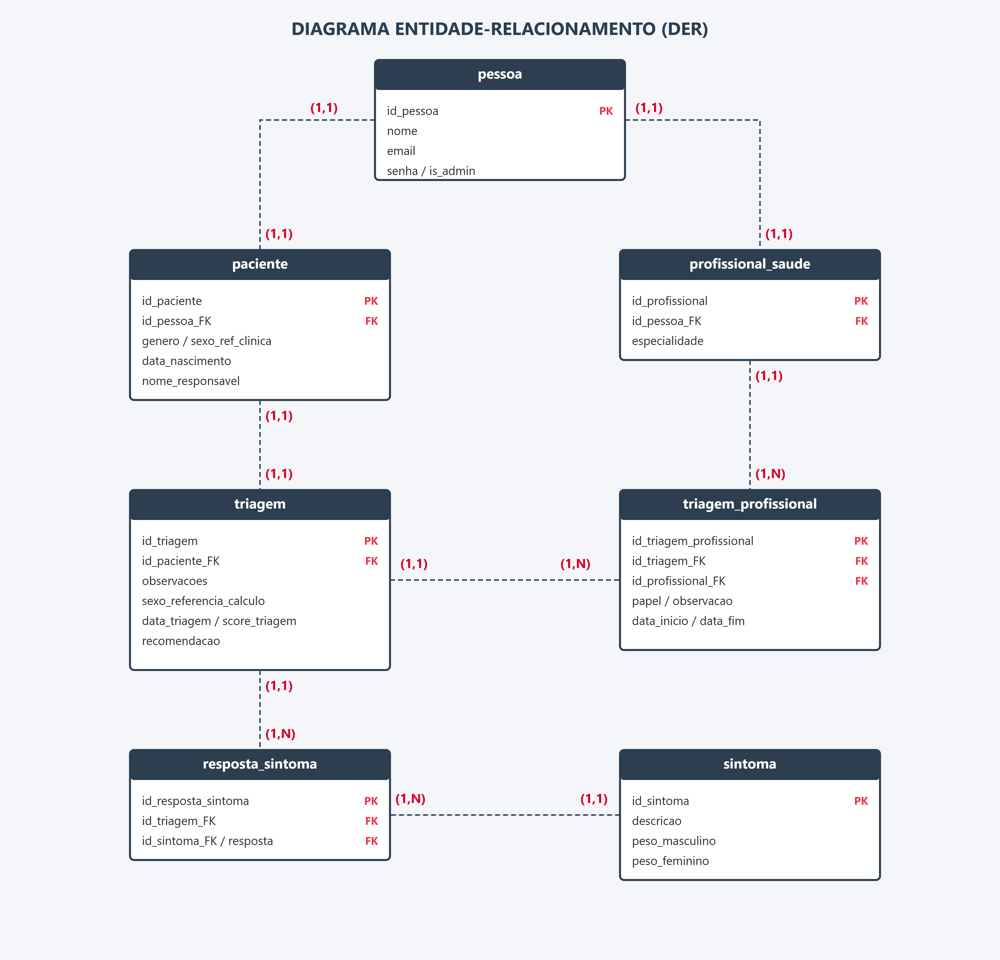
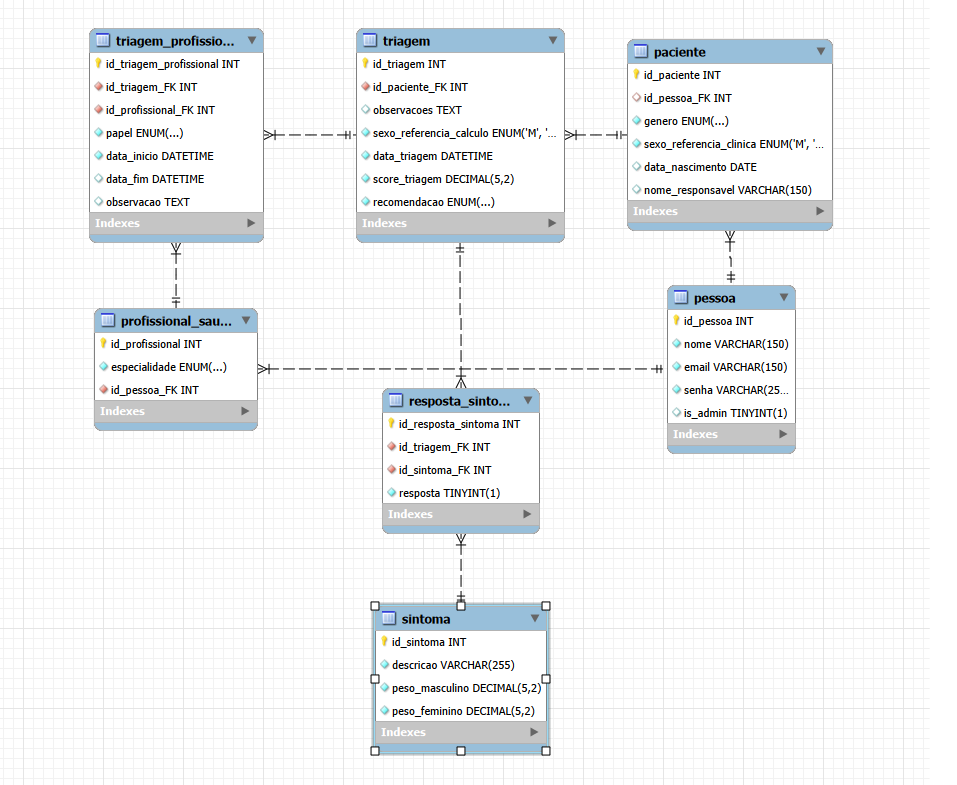

<div align="center">

```
███████╗██╗  ██╗███████╗
██╔════╝╚██╗██╔╝██╔════╝
███████╗ ╚███╔╝ █████╗  
╚════██║ ██╔██╗ ██╔══╝  
███████║██╔╝ ██╗██║     
╚══════╝╚═╝  ╚═╝╚═╝     
```

# 🧬 Checklist Clínico de Triagem — Síndrome do X Frágil

**Uma ferramenta web para reduzir o subdiagnóstico da principal causa hereditária de deficiência intelectual no Brasil**

[](.)
[](.)
[](.)
[](.)
[](.)
[](.)

</div>

---

## 📌 Sobre o Projeto

A **Síndrome do X Frágil (SXF)** é a principal causa hereditária de deficiência intelectual no mundo, causada por uma mutação no gene *FMR1* do cromossomo X. Apesar de sua relevância, o Brasil enfrenta um **alto índice de subdiagnóstico**, decorrente de dois fatores críticos:

- 🔬 **Variabilidade fenotípica**: os sintomas são heterogêneos e se sobrepõem a outras condições, dificultando o reconhecimento clínico;
- 💸 **Barreiras de acesso**: os exames confirmatórios (PCR e Southern Blotting) possuem alto custo e disponibilidade limitada no SUS.

Este projeto propõe uma solução prática: uma **aplicação web de checklist clínico de triagem populacional**, capaz de auxiliar profissionais de saúde a identificar pacientes com suspeita de SXF, calcular um score de risco com pesos validados pela literatura científica e gerar uma recomendação clínica antes de indicar os exames genéticos confirmatórios.

> ⚠️ **Aviso**: Esta ferramenta é um instrumento de **triagem**, não de diagnóstico. O diagnóstico definitivo requer confirmação por exame genético molecular (PCR e/ou Southern Blotting).

---

## 🎯 Funcionalidades

- ✅ Checklist interativo com 12 critérios clínicos (físico, comportamental, neurológico)
- 📊 Cálculo automático de score com pesos diferenciados por sexo, baseados em artigo científico
- 🔐 Controle de acesso com perfis distintos: **Administrador** e **Profissional de Saúde**
- 📝 Geração de relatório em PDF com logo do Instituto Buko Kaesemodel
- 🔍 Histórico de triagens com busca e filtros por nome e recomendação
- 👥 Lista de pacientes com busca e filtros por sexo clínico e faixa etária
- 👤 Cadastro de profissionais de saúde (exclusivo Admin)

---

## 🛠️ Tech Stack

### Backend
| Tecnologia | Função |
|------------|--------|
| Python + Flask | Framework principal e rotas da API |
| Flask-CORS | Comunicação com o frontend React |
| mysql-connector-python | Conector com o MySQL |
| ReportLab | Geração de relatórios em PDF |
| itsdangerous | Autenticação via token |
| werkzeug | Hash seguro de senhas |

### Frontend
| Tecnologia | Função |
|------------|--------|
| React.js | Interface dinâmica e interativa |
| Axios | Comunicação com a API Flask |
| React Router | Navegação entre páginas |
| React Icons | Ícones da interface |

### Banco de Dados
| Tecnologia | Função |
|------------|--------|
| MySQL | Banco de dados relacional principal |

---

## 🗄️ Modelagem do Banco de Dados

### Diagrama Entidade-Relacionamento (DER)



### Modelo Físico (MySQL Workbench)




---

## ⚙️ Documento Técnico de Implantação

### Requisitos de Sistema

| Item | Versão |
|------|--------|
| Sistema Operacional | Windows 10+ / Ubuntu 22.04+ / macOS 12+ |
| Python | 3.13.3 |
| Node.js | 24.11.0 |
| npm | 11.6.1 |
| MySQL Workbench | 8.0.43 |
| Git | Qualquer versão recente |

### 1. Clone o repositório

```bash
git clone https://github.com/joaopdiasdev/IBK_Grupo_6.git
cd IBK_Grupo_6
```

### 2. Configure o banco de dados

Abra o **MySQL Workbench**, crie o banco e execute os scripts na ordem:

```sql
CREATE DATABASE banco_ibk;
```

- Abra `dataBase/schema.sql` → Execute com **Ctrl + Shift + Enter**
- Abra `dataBase/dados_iniciais.sql` → Execute com **Ctrl + Shift + Enter**

Edite o arquivo `backend/dataBase/conexao.py` com sua senha do MySQL:

```python
def conectar_banco():
    return mysql.connector.connect(
        host="127.0.0.1",
        user="root",
        password="SUA-SENHA",
        database="banco_ibk",
        port=3306
    )
```

### 3. Execute o backend

```bash
cd backend
pip install flask flask-cors mysql-connector-python reportlab werkzeug itsdangerous
python app.py
```

Verifique em `http://127.0.0.1:5000` — deve aparecer `{"status": "Backend rodando"}`.

### 4. Execute o frontend

Abra um **novo terminal** (mantenha o backend rodando):

```bash
cd frontend
npm install
npm start
```

O sistema abrirá automaticamente em `http://localhost:3000`.

> ⚠️ Mantenha os dois terminais abertos — um para o backend e outro para o frontend.

---

## 📖 Documentação

| Documento | Link |
|-----------|------|
| 📄 Tutorial de Instalação (documento) | [Acessar](https://docs.google.com/document/d/10XHU0iMfqrlLesGGvNTp5uoe09p_Gr9OC1ivmkV1uhs/edit?usp=sharing) |
| 📘 Manual de Uso (documento) | [Acessar](https://docs.google.com/document/d/1AqAvTqzpTVztEQNyZr7dhwqX7zbPEQJywvA5GZReEho/edit?usp=sharing) |

---

## 🎥 Vídeos

| Vídeo | Link |
|-------|------|
| 🎬 Tutorial de Instalação | [Assistir no YouTube](https://youtu.be/cTflnQAm6nw) |
| 🎬 Manual de Uso | [Assistir no YouTube](https://youtu.be/GUVrF5D8RLc) |

---

## 📁 Organização do Projeto

- 📋 **Gestão de tarefas**: Trello — divisão por sprints com responsáveis e prazos
- 🔀 **Versionamento**: GitHub — branches por feature, commits padronizados ao longo do projeto

---

## 👨‍💻 Equipe — Grupo 6

| Nome | Função | GitHub |
|------|--------|--------|
| **João Pedro Schmidt Dias** | Backend | [@joaopdiasdev](https://github.com/joaopdiasdev) |
| **Felipe Krupa Sokulski** | Frontend | [@felipesokulskidev](https://github.com/felipesokulskidev) |
| **Tiago Augusto Almeida Miglioli** | Banco de Dados | [@tiagomiglioli](https://github.com/tiagomiglioli) |
| **Victor Henrico Schroeder** | Backend | [@SchroederVictor](https://github.com/SchroederVictor) |

---

## 📜 Licença

Este projeto está sob a licença **MIT**. Consulte o arquivo [LICENSE](./LICENSE) para mais detalhes.

---

<div align="center">

**Desenvolvido pensando em contribuir com a saúde brasileira**

*"O diagnóstico precoce muda vidas."*

</div>